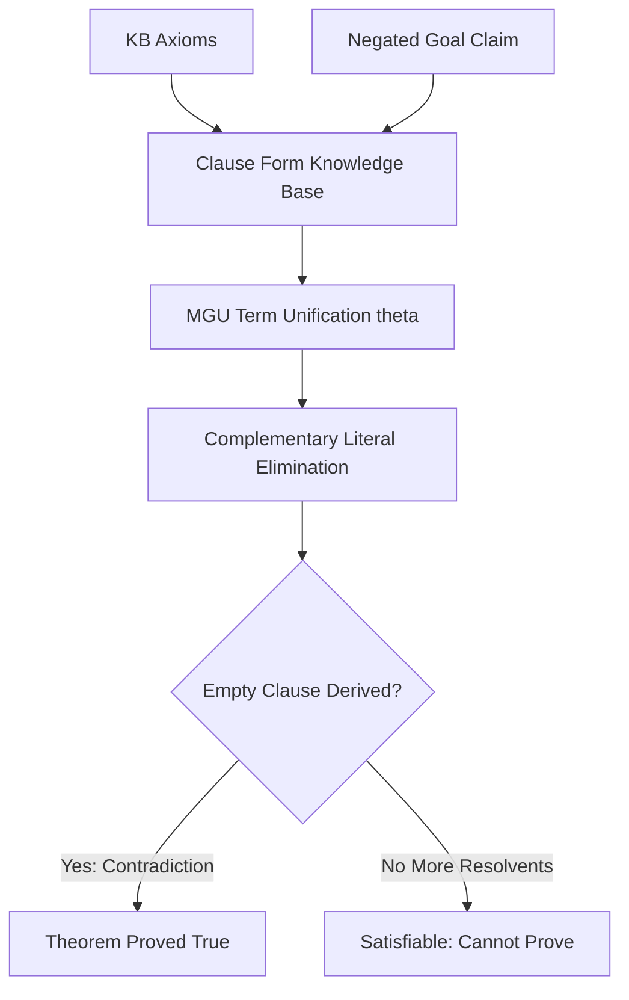

# GenPark First-Order Logic Resolution Prover Skill

First-Order Logic (FOL) resolution theorem prover using Robinson's Most General Unification (MGU) refutation.

Discover more at [GenPark](https://genpark.ai) and the [GenPark MCP Catalog](https://genpark.ai/mcp).

## Features
- Robinson resolution refutation principle.
- Most General Unification (MGU) with variable substitution.
- Zero external dependencies.
